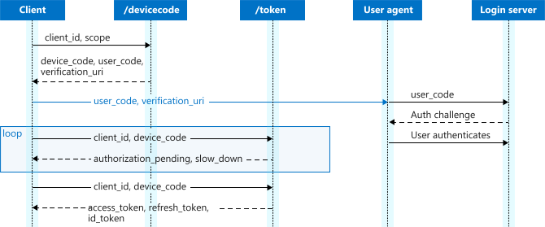
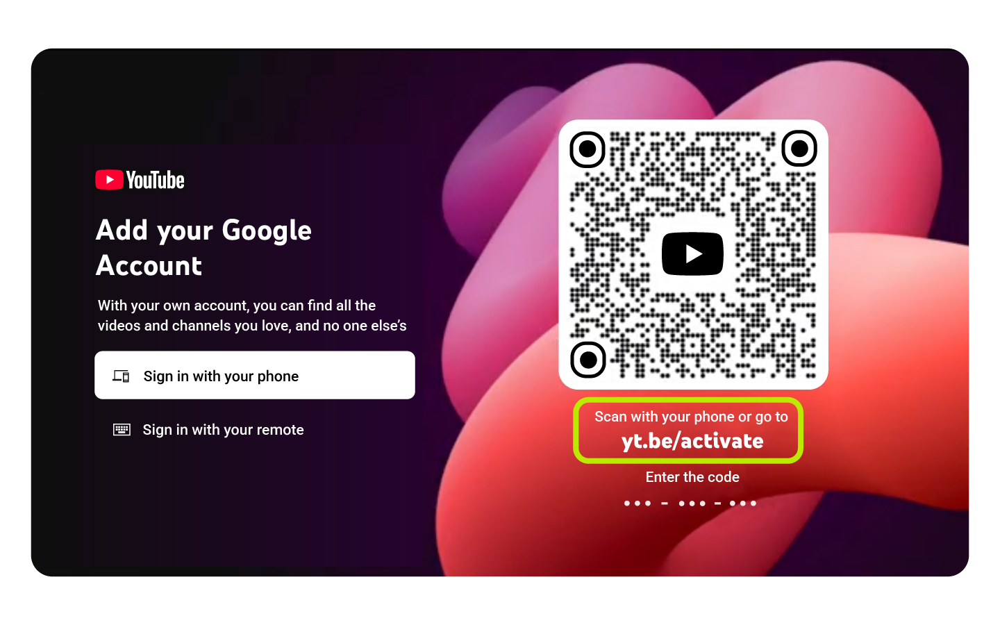
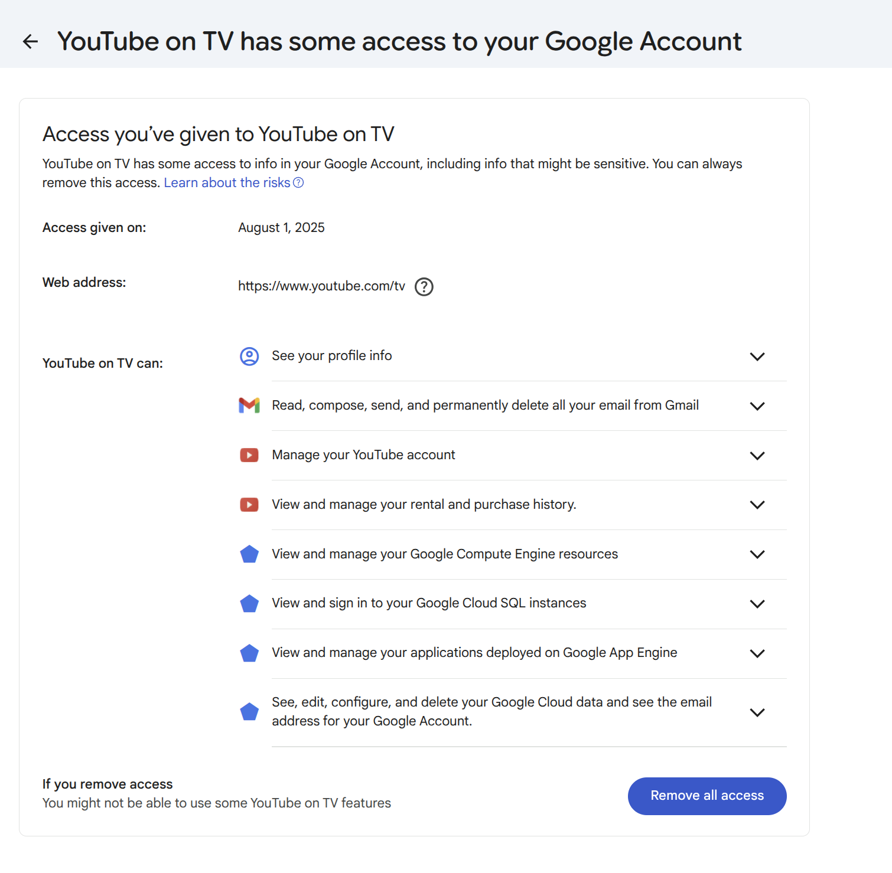
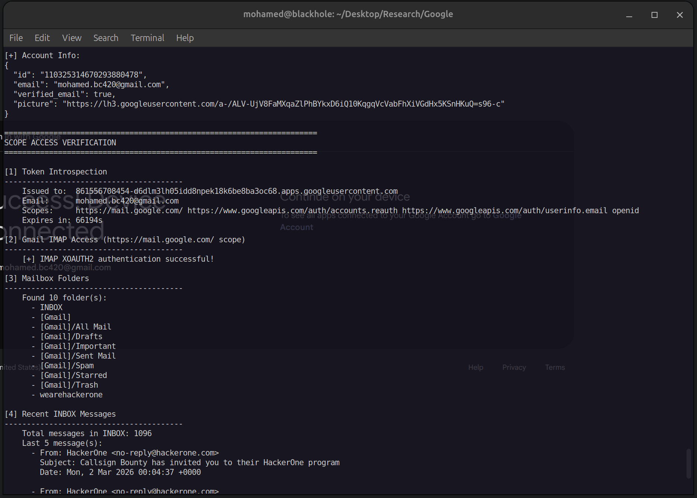

# TL;DR

This one started from setting up the YouTube app on my PS5. The device
authorization grant (RFC 8628) it uses, the flow TVs, consoles, and CLIs
rely on when they don't have a browser of their own, turned out to hide two
stacked bugs in Google's implementation.

Two bugs stack together. First, the session that anchors a device-code
sign-in is fully transferable: copy the sign-in URL from one browser to
another and the second browser's login satisfies the first device's poll.
Second, the authorization server never binds `client_id` and `scope` to the
`device_code` server-side, so both can be swapped in the URL after the fact.
Chain the two together with the `prompt=none` parameter and any link, opened
by a victim who has ever used "Sign in with Google" anywhere, silently hands
over an access token for an arbitrary Google-registered client, no click, no
consent screen, no 2FA prompt, almost no trace in the victim's account
activity.

Reported to Google's VRP on Feb 25, 2026, initially closed twice as "won't
fix": social engineering, reopened after a one-click PoC, fixed by Mar 28,
2026, and rewarded $13,337. Details on that back-and-forth are in the
[disclosure timeline](#9-disclosure-timeline) below.

# 1. Intro

Most of the well-known attacks on OAuth go after the client or the resource
server: a malicious app, an open redirect, a signing-algorithm mix-up. They
leave the authorization server itself alone, because it's the one party in
the protocol that's supposed to be unshakeable, the thing every other trust
decision is anchored to. This is a story about going after that assumption
directly, in the one corner of OAuth that's explicitly designed to let the
login happen on a completely different screen: the device authorization
grant.

It started as a mundane afternoon setting up a TV app on a game console, and
it ended with a way to silently take over accounts on virtually any site
that offers "Sign in with Google." Getting from one to the other took two
separate findings stacked on top of each other, a rejected report, and a fix
to the fix. What follows is that story, roughly in the order it actually
happened, blockers included.

# 2. The Device Authorization Grant

Most OAuth flows assume the device asking for access has a browser sitting
right there to redirect through. RFC 8628 exists for the case where it
doesn't: a smart TV, a games console, a headless CLI. The shape is different
from the usual redirect dance:

1. The device calls the authorization server directly (`POST /device/code`)
   and gets back a `device_code` (secret, stays on the device) and a
   `user_code` (short, shown on screen).
2. The device displays the `user_code` and tells the user to go to a URL,
   `google.com/device` in Google's case, on *any other* browser.
3. The user opens that URL on their phone or laptop, types the code, signs
   in, and consents.
4. Meanwhile the device has been polling `POST /token` with its
   `device_code`. Once the user finishes step 3, the next poll returns an
   access token.



The whole point of the design is that the device and the browser doing the
authenticating can be, and usually are, two completely different pieces of
hardware. That's also exactly what makes this flow interesting to attack: the
protocol *already* expects the login to happen somewhere else. The only thing
holding the model together is that the "somewhere else" has to be a browser
*the legitimate device owner* is sitting at.

That's the assumption. The rest of this write-up is what happened when I
went looking for the place where Google's implementation stops enforcing it.

# 3. Setting Up YouTube TV on a PS5

I was setting up the YouTube app on my PS5, ordinary first-run setup. The
console has no keyboard and no way to type a password comfortably with a
controller, so it does the sensible thing: it shows a short `user_code` on
screen and tells you to go sign in on your phone instead. I typed the code
into `google.com/device`, signed into Google, approved the consent screen,
and a few seconds later the PS5 was logged in.



Nothing about that felt unusual as a user, but the flow itself was
intriguing: a screen with no keyboard asking me to authenticate on a
completely separate device, and coming back logged in seconds later. That
disconnect between where I typed my password and where the session actually
landed is what made me want to look at it more closely. Behind the scenes,
that's:

- `POST https://oauth2.googleapis.com/device/code` → `device_code` + `user_code`.
- The PS5 polling `POST https://oauth2.googleapis.com/token` with that `device_code`.
- My phone's browser walking through `https://accounts.google.com/o/oauth2/v2/auth?…`
  to finalize consent once I typed the code and signed in.
- The PS5's next poll returning an access token.

Standard, boring, RFC-compliant. The interesting part is what that
`accounts.google.com/o/oauth2/v2/auth` URL is actually carrying, and what
happens if you don't treat it as disposable. That question is exactly what
kicked off everything that follows.

# 4. The Transferable Session

The obvious question with any flow where "the state lives in a URL" is: what
happens if you just move the URL? If the entire sign-in step for a
`device_code` can be handed to someone else, then whoever finishes that
sign-in step ends up logged into *my* device, not theirs.

RFC 8628 §5.4 anticipates exactly this and tells implementers not to let it
happen: the whole security model of the flow depends on the user completing
verification on a device they're *not* about to lose control of.

I started a fresh device flow on the PS5, walked through `google.com/device`
on a laptop, and at the consent screen copied the resulting URL into a
second browser. That failed outright: no session for the second browser to
pick up.

But the device-code page asks for an email address *before* showing consent.
Entering one forwards the browser to a different endpoint entirely: a
*challenge* page at `accounts.google.com/v3/signin/challenge/…`, carrying a
new parameter, `TL=APouJz6T…`. Sending *that* URL to a second browser worked.
The second browser prompted a completely normal Google sign-in. Seconds after
logging in, that account showed up on the PS5.

`TL` is an encrypted blob carrying the session state, practically certain to
be the `device_code`, or something that resolves to it, given that it's the
only thing left in the URL that could anchor the poll back to a specific
device.

**Vulnerability #1: the device-code sign-in session is transferable via URL.**
RFC 8628 explicitly says it shouldn't be. Send the link, get the account.

That's a real account takeover, but a narrow one. YouTube TV's scopes are
capped by design, and that cap is the wall I hit next.

# 5. Breaking the Scope Fence

A YouTube TV account takeover is real, but Google fences the device flow to a
short, deliberately low-risk scope allowlist. Per
[Google's own docs](https://developers.google.com/identity/protocols/oauth2/limited-input-device):
*"This OAuth 2.0 flow supports a limited set of scopes."* The complete list:

- `openid`, `email`, `profile`
- `youtube`, `youtube.readonly`
- `drive.appdata`, `drive.file` (app-scoped Drive only, not full Drive)

No Gmail, no full Drive, no `cloud-platform`, no `compute`. The access token
I got only worked against a YouTube TV–internal API: enough to like a video
or subscribe to a channel. Not exactly a headline bug.

So I looked again at the transferable challenge URL:

```text
accounts.google.com/v3/signin/challenge/…
  ?TL=APouJz6T…              <- encrypted session state
  &response_type=none
  &client_id=861556708454-…   <- YouTube TV
  &scope=…                    <- YouTube scopes
```

Two things stand out. `response_type=none` means this isn't a normal
code/token redirect: there's nothing coming back to a callback at all. And
there is **no `redirect_uri` anywhere in the URL**. The entire boundary that
OAuth normally relies on to pin where a grant goes is simply absent from this
endpoint, because the grant never gets delivered through the browser; it
gets delivered out-of-band, over the device's `/token` poll.

The only thing anchoring the session is `TL`. `client_id` and `scope` are
just along for the ride in the query string. So: keep `TL`, swap `client_id`
for a different application, and see which client the authorization server
ends up authenticating.

I scripted the device-code issuance, took the resulting URL, and changed
`client_id` from YouTube TV to Google's own **Cloud SDK** client, with
`scope` changed to `cloud-platform`, `compute`, `appengine.admin`. The
consent screen that came back said **Google Cloud SDK**, listing the
elevated scopes. Approving it, my polling script, still polling with the
*original* YouTube TV `device_code`, got back a token on its next call.
Inspecting it: `cloud-platform`, `compute`, `appengine.admin`. Not YouTube.

**Vulnerability #2: the server never validates that the `client_id` and
`scope` in the authorization URL match what the `device_code` was actually
issued for.**

Combined with vulnerability #1, the authorization server ends up issuing
tokens under one client's identity (Google Cloud SDK, or any other
Google-registered client, first- or third-party) for a session that started
under a completely different one (YouTube TV). `redirect_uri` isn't just
weakly validated here: it's not present at all, because the grant never
travels through a redirect in this flow to begin with.


The escalation chain worked end to end, at least on paper. Only one step was
left: telling Google about it, and finding out whether they'd agree it was a
bug at all.

# 6. From Consent Screen to One Click

I filed this as a report. It came back rejected the next day, citing user
interaction: the victim "consented." Fair, in a narrow sense: the consent
screen is genuinely rendered by Google, the click is a genuine click. But
the *thing being consented to* was shaped entirely by parameter substitution
in a link I built, and from the victim's side there is nothing to notice
that's different from any other Google sign-in. Still, "user interaction"
was the stated bar, so the next step was removing it.

OAuth has a `prompt` parameter for exactly the case of skipping the consent
screen: set to `none`, it tells the authorization server not to show any UI
if the user has already granted the requested scopes to that client before.
It's meant to be narrow, restricted to low-risk scopes like `openid`,
`email`, `profile`, and gated on prior consent.

In practice it isn't narrow at all. "Sign in with Google" is everywhere, and
most people have already granted `openid email profile` to dozens, sometimes
hundreds, of apps over the years without ever thinking about it again.

Take the weaponized device-code URL, drop in Facebook's `client_id` (any
site using "Sign in with Google" works the same way), set `scope=openid
email profile`, add `prompt=none`. The victim opens the link, and that's the
only action required: no consent screen, no button to press. The browser
silently completes the flow in the background, the polling script receives
an `id_token` for that third-party application, and that token replays
cleanly against the app's own "Sign in with Google" endpoint.

**One link. Opening it is the only interaction required. Account takeover on
virtually any application that uses Sign in with Google.**


The technical bypass was solid. What I didn't know yet was whether any of it
would actually be visible, to the victim or to Google's own monitoring, if
it were used for real.

# 7. Why the Victim Never Notices

The natural follow-up: surely *something* surfaces to the victim: a login
alert, a new entry under connected apps, a 2FA prompt? It doesn't, and that's
not incidental. Every signal that would normally catch this gets routed
around by the shape of the device-code flow itself.

**Audit trail pollution.** `myaccount.google.com/connections` shows the
*original* client bound to the `device_code`, YouTube TV, never the
substituted application. To find any trace of the attack, a victim would
have to open the connections page, scroll to find "YouTube TV" among
however many connected apps they have, click into it, click "see details" to
expand the granted scopes, and then recognize that YouTube TV requesting
`cloud-platform` / `compute` / `appengine.admin` is not normal. Five
deliberate steps and a piece of domain knowledge very few people have.



**Implicit 2FA bypass.** The victim goes through a completely ordinary Google
sign-in, which already satisfies any 2FA they have configured. The token
handoff to the attacker happens afterward, over the device poll, with no
further prompt of any kind. The actual high-risk action, an OAuth grant
under an arbitrary client's identity, never trips a high-risk challenge,
because as far as the authentication layer is concerned, nothing risky
happened; a user just logged in normally.

Stealth, solved. The remaining question was reach: how far the same
substitution trick could be pushed past YouTube TV's own scopes.

# 8. Extending the Primitive

Stealth is one axis; reach is the other. The same `client_id`/`scope`
substitution keeps paying out against different corners of the Google
ecosystem.

**Persistent access via `accounts.reauth`.** Add that scope to the
substitution and the resulting grant can refresh indefinitely, with no
further victim interaction required: a shoot-and-forget backdoor rather than
a one-time token.

**A Gmail backdoor via IMAP, not the REST API.** Substituting a `client_id`
that's allowed to request `https://mail.google.com` (Apple's iOS Mail
client, for instance) gets a token scoped to full Gmail access. Hitting the
Gmail REST API with it fails: *"Gmail API has not been used in project
861556708454 before or it is disabled."* That project ID belongs to YouTube
TV, and the original device-code client never had the Gmail API enabled.
That's a project-level gate, not a token-level one, so it's worth checking
whether there's another door into the same mailbox. Gmail's IMAP server
supports OAuth via the **XOAUTH2** SASL mechanism, using the exact same
`https://mail.google.com/` scope but going through `imap.gmail.com:993`
instead of the REST API's project-gated surface. It accepts the token
without issue. Full inbox access, with the same token the REST API had just
rejected.



End to end: a transferable session, plus unvalidated `client_id`/`scope`
binding, plus `prompt=none`, equals a link that's invisible to the person who
opens it and ends in a fully compromised account, Gmail included.

Chain complete: transferable session, unbound `client_id`/`scope`,
`prompt=none`, silent to the victim, and a Gmail backdoor at the end of it.
Time to see what Google's VRP panel made of all that.

# 9. Disclosure Timeline

| Date | Event |
|---|---|
| Feb 25, 2026 | Report filed with Google VRP |
| Mar 2, 2026 | Closed: *Won't Fix (Intended Behavior)*, citing "social engineering" |
| Mar 2, 2026 | Pushed back same day |
| Mar 3, 2026 | Reopened, then closed again: *Won't Fix (Infeasible)* |
| Mar 3, 2026 | Countered with a `prompt=none` one-click PoC against Facebook's `client_id` |
| Mar 4, 2026 | Reopened a second time and **accepted**; bug filed with the product team |
| Mar 28, 2026 | Marked fixed |
| Apr 2, 2026 | Rewarded **$13,337** |

The two rejections both leaned on the same argument: that tricking a user
into approving an OAuth prompt is a social-engineering problem, not a
vulnerability in Google's implementation. That didn't hold up on either
pass. The first rejection ignored that this is the exact sign-in flow every
Google user already knows, on `accounts.google.com`, arriving at an app that
has no business holding `cloud-platform` or `appengine.admin` scopes doing
exactly that. The second treated it as equivalent to installing a malicious
OAuth app, which the `prompt=none` PoC against Facebook's `client_id`
directly disproved: there was no prompt to approve, and no app to install;
the victim only had to open a link.

# 10. Mitigations

For a flow that's explicitly designed to hand sign-in off to a second
device, the fix has to happen server-side, since there's nothing meaningful
a client application can check on its own:

1. Keep `user_code`, `device_code`, and any session reference that resolves
   to them out of URLs entirely. If a session can't be copied into a
   different browser, it can't be handed to a victim.
2. Bind `client_id` and `scope` to the `device_code` at issuance time,
   server-side. At the consent step, look those values up from that binding
   instead of trusting whatever the URL says; reject any mismatch.
3. On the consent screen, show device information (name, model) and require
   the user to actively confirm that device is the one in front of them.

# 11. Conclusion

The device authorization grant is a narrow, deliberately low-trust flow,
right up until the authorization server treats "who is asking" and "what are
they asking for" as details that only need to be true at the *start* of the
flow, not checked again by the time consent is granted. Once the session
itself turned out to be transferable across browsers, the missing binding
between `device_code` and `client_id`/`scope` stopped being a narrow YouTube
TV bug and became a way to mint tokens for any Google-registered client,
first-party or third-party, capped only by which scopes that client happens
to be allowed to request.

Thanks for reading.
